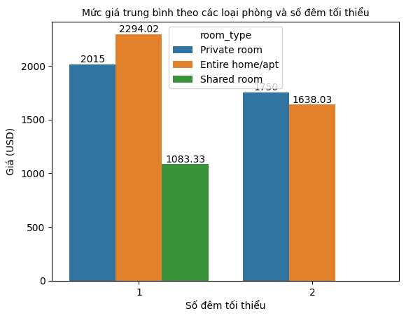

# Lập trình cho Khoa học dữ liệu 
## Final Project - Thu thập, phân tích cho trả lời câu hỏi về bộ dữ liệu New York City Airbnb 
### I. Thông tin nhóm:

MSSV|Họ tên
-|-
21127700|Lê Phước Thịnh Tiến
21127704|Phạm Khánh Toàn
### II. Thông tin đề tài:
#### **_01. Dataset:_**
[NYC Airbnb Open Data](https://www.kaggle.com/datasets/dgomonov/new-york-city-airbnb-open-data) chứa thông tin của 48895 căn Airbnb 

#### **_02. Meaningful questions:_**
- Tình hình hiện tại về sự phân bố các Airbnb trên thành phố New York là như thế nào ? 
  - Mục đích: thấy được sự tình hình phân bố và giá cả nhà ở theo từng khu vực ở thành phố New York. Từ đó, có thể thấy được đâu là trung tâm dựa vào đó chúng ta có thể lựa chọn Airbnb tùy theo ngân sách để có thể chi khi đi du lịch hoặc ở ngắn hạn hay là nơi đáng để đầu tư 
- Tình hình thị trường các căn hộ có giá trên 1000$ 1 đêm với số đêm tối thiểu ít hơn 2 ngày diễn ra như thế nào?
  - Mục đích: Giúp khách hàng so sánh mức giá, số lượng đánh giá, cũng như giúp đưa ra quyết định thuê một khu vực nào đó. Hơn nữa, có thể giúp nhà đầu tư nhìn được tổng quan thị trường các căn hộ (có giá trên 1000$ 1 đêm và thời hạn thuê tối thiểu ít hơn 2 ngày).
- Làm sao có thể dự đoán được giá của một căn airbnb (giả sử đang hướng đến thị trường có mức giá dưới 1000$ một đêm) ?
  - Mục đích: giúp người đặt phòng dự đoán được giá của căn hộ mình cần thuê, cũng như giúp chủ các căn hộ đưa ra mức giá phù hợp cho căn hộ của mình.

#### **_03. Questions analysis:_**
- Câu hỏi 1:
    - Gom nhóm các Airbnb theo từng khu vực và tính trung bình giá cả , số lượng các Airbnb theo từng khu vực
    - Xem giá của 2 khu vực có giá tiền cũng như số lượng đông nhất : Manhattan, Brooklyn
    - Đọc file từ thư viện `geopandas` để phục vụ cho vẽ bản đồ
    - Vẽ hình thể hiện sự phân bố về giá cả , số lượng trên bản đồ thành phố New York

> **Kết quả:** 
> - Số lượng rao bán và giá trung bình tại Manhattan thuộc top đầu thành phố New York nhờ vị trí địa lý tuyệt vời. Là nơi tốt để đi du lịch nhiều thành phố khi Manhattan gần như  là trung tâm của Thành phố New York và từ Manhattan có thể di chuyển thuận tiện đến các thành phố khác cũng như là Manhattan có nhiều địa điểm hấp dẫn như Tòa nhà Empire State, Madison Square Garden,..
> - Queens và Brooklyn thích hợp cho những ai thích khám phá New York vì nằm ở vị trí trung tâm và thuận tiện cho du khách di chuyển đến các khu vực khác. Tuy nhiên, có sự chênh lệch cả về giá lẫn số lượng lựa chọn giữa Queens và Brooklyn khi số lượng AirBnbs ở Brooklyn rất lớn và giá cũng cao hơn ở Queens khoảng 24%.
> - Bronx và State Island đều có số lượng rao bán ít nhưng có sự chênh lệch về giá ở 2 khu vực này khi giá của Airbnb ở State Island cao hơn Bronx khoảng 30$

> - Phân bố số lượng Airbnb ở New York 

> - Phân bố giá trung bình Airbnb ở New York 

- Câu hỏi 2:
  - Lấy ra các căn hộ ở các khu vực mà có giá hơn 1000 USD một đêm và có thời gian lưu trú tối thiểu một hoặc hai đêm.
  - Xem xét số lượng các loại phòng phù hợp với yêu cầu đưa ra
  - Xem xét mức giá trung bình của các căn hộ theo loại phòng và số đêm ở tối thiểu
  - Xem xét mức giá trung bình của các căn hộ theo loại phòng và khu vực
  - Xem xét số lượng review tại mỗi khu vực

> **Kết quả:**
> - Từ phân tích và trực quan hóa trên, có thể kết luận rằng Airbnb có các phòng đắt đỏ hầu hết nằm ở khu vực Brooklyn và Manhattan; đa phần là entire home/apt và private room. Mặc dù Manhattan có số lượng thông tin đăng cao nhất về các phòng sang trọng. Tuy nhiên, phòng đắt đỏ nhất lại nằm ở Brooklyn, đó là căn airbnb loại entire home/apt và có giá là 8000 đô la mỗi đêm.
> - Qua các phân tích trên, ta thấy được tổng quan thị trường Airbnb đắt đỏ ở New York qua từng đặc điểm như số lượng căn hộ, loại căn hộ, mức giá,...
> - Người dùng và nhà đầu tư dùng các phân tích trên để từ đó có thể đưa ra các quyết định của mình. (Ví dụ đối với các nhà đầu tư, có thể xem xét đầu tư xây dựng thêm nhiều căn hộ ở các vùng như Queens, Bronx, Staten Island vì các khu vực này số lượng phòng đạt yêu cầu còn khá ít)

> - Mức giá trung bình của các Airbnb theo loại phòng và số đêm ở tối thiểu

> - Mức giá trung bình của Airbnb theo từng khu vực

- Câu hỏi 3:
  - Lấy ra các phòng thỏa mãn yêu cầu mà chúng ta đa hướng tới, đó là bài đăng của các căn airbnb có giá dưới 1000$
  - Xem xét sự phân bố của 'price' đối với cắc căn airbnb có giá dưới 1000$
  - Fine tuning để tìm ra bộ hyperparameters tốt nhất cho Linear Regression và Random Forest
  - Huấn luyện và kiểm tra mô hình 
  - Đánh giá mô hình bằng các chỉ số MAE, MSE , R2 score của 2 mô hình 

> **Kết quả:** Kết quả R2 score khá thấp và chỉ số MAE , MSE đều khá lớn cho thấy các mô hình đều không đưa ra kết quả khả quan 

#### **_04. More Information:_**
- [Github](https://github.com/Gabien21/CSC17104_P4DS_final_project)

#### **_05. Planning:_**

